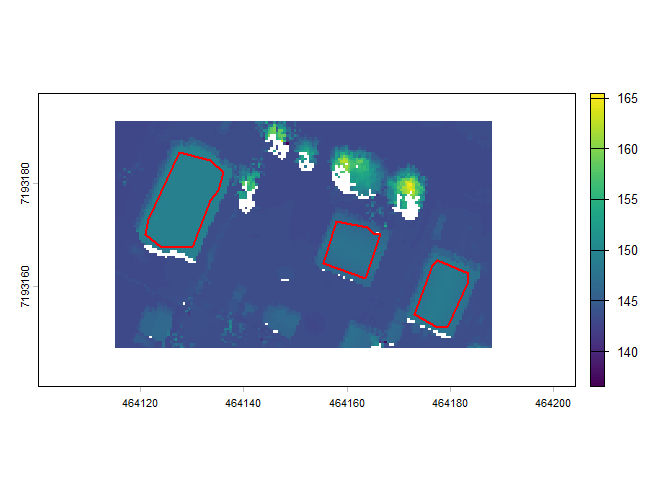
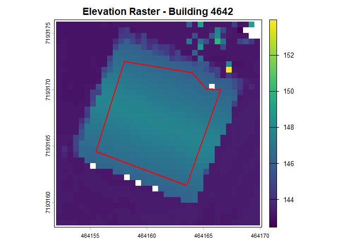
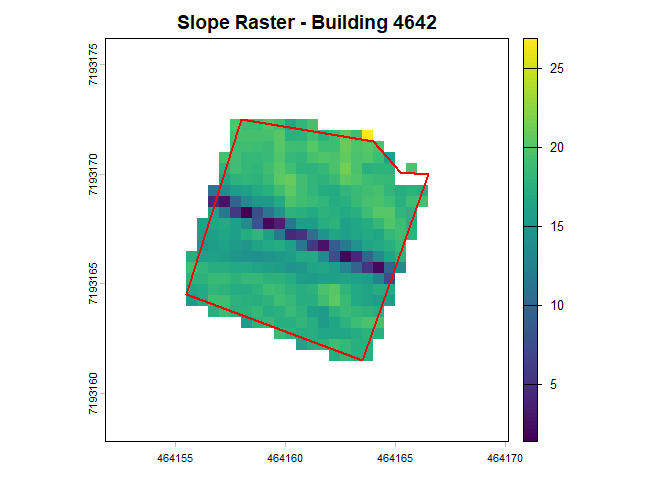
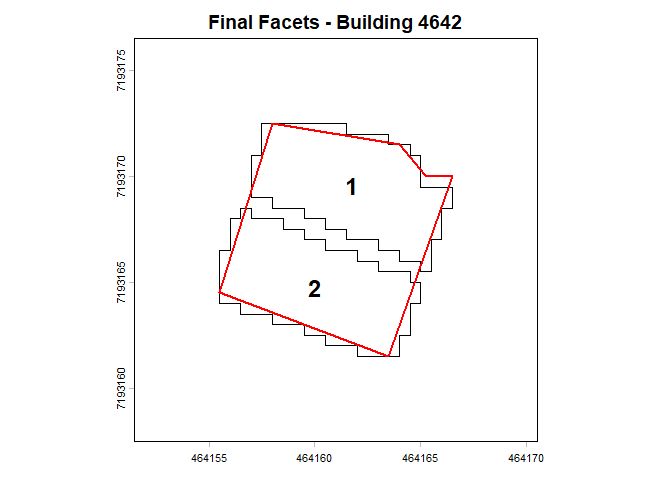

<!-- README.md is generated from README.Rmd. Please edit that file -->

# facetseparater

<!-- badges: start -->

<!-- badges: end -->

The goal of facetseparater is to use LiDAR-derived elevation data to
separate building roofs into separate facets and give summary statistics
by facet. It builds off the building polygon and roof slope extraction
workflow implemented by the rasterpolygonizer package found
[here](https://github.com/jashonnew/rasterpolygonizer).

## Package Installation

You can install the development version of facetseparater from
[GitHub](https://github.com/) with:

``` r
# install.packages("pak")
pak::pak("dawson-tree/facetseparater")
```

## Package Use

The facetseparater package includes a sample elevation raster, a sample
snow depth raster, and a set of sample building polygons to get started.
The set of polygons can be accessed with the `sample_buildings` variable
and both the rasters can be loaded into your global environment like so:

``` r
library(facetseparater)
library(terra)
#> Warning: package 'terra' was built under R version 4.5.3
#> terra 1.9.46

sample_raster <- terra::rast(system.file("extdata", 
                                         "sample_raster.tif", 
                                         package = "facetseparater"))
sample_snow_depth <- terra::rast(system.file("extdata", 
                                             "sample_snow_depth.tif", 
                                             package = "facetseparater"))
```

The `plot_raster` function can be used to plot a raster and building
polygons in the extent of the polygons.

``` r
plot_raster(sample_raster,
            sample_buildings)
```



The `facet_separation` function is used to separate a specific building
roof into its distinct roof facets. The function also has options for
whether to print out information about the facet separation,
two-dimensional plots showing the process of arriving at the final
facets, and three-dimensional plots that give you a closer look at the
final facets and how well they fit the data. For the demonstration, we
will use the options that print out extra information and
two-dimensional plots.

``` r
fs_results <- facet_separation(4642,
                               sample_buildings,
                               sample_raster,
                               quiet = FALSE,
                               plot = TRUE,
                               plot3d = FALSE)
#> Summary of KDE Filter Results
#> Mode of Slope Distribution: 17.83°
#> KDE Filter Boundaries: [12.53°, 24.17°]
#> Points Retained: 317 out of 349 (90.8%)
#> Facet 1 Processed | Slope: 18.03° | Inliers: 160 | Top 5% Spread: 1.27°
#> Facet 2: Not enough points
#> Facet 3 Processed | Slope: 17.07° | Inliers: 156 | Top 5% Spread: 0.86°
```



The `facet_snow_summary` function is used on the output from the
`facet_separation` function and a snow depth raster to create a
dataframe containing the characteristics of each individual roof facet,
including slope, aspect, and mean snow depth.

``` r
fs_snow_results <- facet_snow_summary(fs_results,
                                      sample_snow_depth)
fs_snow_results
#>   facet_no slope_deg aspect_deg n_inliers slope_range top_5_percent_count
#> 1        1  18.02987   23.97634       160   1.2738777                  10
#> 2        2  17.07494  201.58858       156   0.8557606                  10
#>   building_id snow_depth
#> 1        4642  0.4849461
#> 2        4642  0.5521458
```
